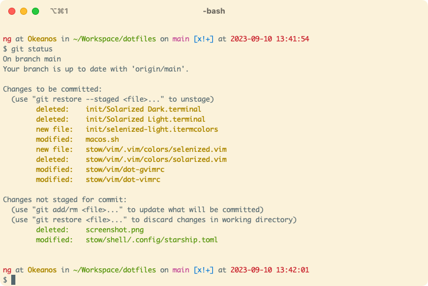

# Okeanos’ dotfiles



## Installation

**Warning:** If you want to give these dotfiles a try, you should first fork this repository, review the code, and
remove things you don’t want or need. Don’t blindly use my settings unless you know what that entails. Use at your own
risk!

**Warning:** For this to work properly on macOS Mojave and later
read [this issue](https://github.com/mathiasbynens/dotfiles/issues/849) carefully and add all necessary binaries to
the `Full Disk Access`.

### Getting Started

1. Manually download [`brew.sh`](https://raw.githubusercontent.com/Okeanos/dotfiles/main/brew.sh) &
   [`Brewfile`](https://raw.githubusercontent.com/Okeanos/dotfiles/main/Brewfile)
2. Update the `Brewfile` to only install software you actually want
3. Execute `brew.sh` from your shell
4. You can now clone the repository wherever you want (I like to keep it in `~/Workspace/dotfiles`)
5. You can now `bootstrap.sh` your system
6. **Optionally** and **after a careful review** you can now run `macos.sh`

#### Installing Brew & other Software (`brew.sh`)

When setting up a new Mac, you need to install some common [Homebrew](https://brew.sh/) formulae (after installing
Homebrew, of course) for this repository to work as expected:

```bash
./brew.sh
```

Some functionality of these dotfiles depends on formulae installed by `brew.sh`. If you don’t plan to use `brew`,
you should look carefully through the `Brewfile` and manually install any particularly important tools manually. Good
examples of these are Bash and Git.

#### The bootstrap script (`bootstrap.sh`)

The bootstrapper script will pull in the latest version and symlink the files to your home folder
using [gnu-stow](https://www.gnu.org/software/stow/).

```bash
cd ~/Workspace/dotfiles && ./bootstrap.sh
```

To update, `cd` into your local `dotfiles` repository and then run:

```bash
git pull --rebase --autostash
```

This will automatically apply any updates to existing dotfiles – apply new ones by running the bootstrapper again.

#### Sensible macOS defaults (`macos.sh`)

When setting up a new Mac, you may want to set some sensible macOS defaults. Please note that you really ought to read
the contents of the following script very, very carefully because it changes a large number of system settings. You can
apply it by invoking it like this:

```bash
cd ~/Workspace/dotfiles && ./macos.sh
```

## Modifying the `$PATH`

If `~/.path` exists, it will be sourced along with the other files, before any feature testing (such as
[detecting which version of `ls` is being used](https://github.com/mathiasbynens/dotfiles/blob/aff769fd75225d8f2e481185a71d5e05b76002dc/.aliases#L21-L26)) <!-- markdownlint-disable-line MD013 --> <!-- editorconfig-checker-disable-line -->
takes place.

Here’s an example `~/.path` file that adds `/usr/local/bin` to the `$PATH`:

```bash
export PATH="/usr/local/bin:$PATH"
```

## Add custom commands without creating a new fork

If `~/.extra` exists, it will be sourced along with the other files. You can use this to add a few custom commands
without the need to fork this entire repository, or to add commands you don’t want to commit to a public repository.

An example of `~/.extra` by the original author of this repository looks something like this:

```bash
# Git credentials
# Not in the repository, to prevent people from accidentally committing under my name
GIT_AUTHOR_NAME="Foo Bar"
GIT_COMMITTER_NAME="$GIT_AUTHOR_NAME"
git config --global user.name "$GIT_AUTHOR_NAME"
GIT_AUTHOR_EMAIL="foo.bar@example.org"
GIT_COMMITTER_EMAIL="$GIT_AUTHOR_EMAIL"
git config --global user.email "$GIT_AUTHOR_EMAIL"
```

You could also use `~/.extra` to override settings, functions and aliases from my dotfiles repository. It’s probably
better to [fork this repository](https://github.com/Okeanos/dotfiles/fork) instead, though.

## Unlinking / Uninstalling

If you want to unlink particular dotfiles (e.g. for `vim`) you can execute the following command:

```bash
cd ~/Workspace/dotfiles && stow --dotfiles --delete --dir "stow" "vim" -t "${HOME}"
```

If you want to unlink (uninstall) all dotfiles managed by this repository you can use the `unlink.sh` script. This
operation is non-destructive and will only remove the symlinks from your `${HOME}` directory. Any customizations,
e.g. `.extra` or `.gituser`, that were created by you will stay in `${HOME}`. You can restore the dotfiles again by
running `bootstrap.sh`.

```bash
cd ~/Workspace/dotfiles && ./unlink.sh
```

## Original Author

These dotfiles are a largely rewritten/updated [fork](https://github.com/mathiasbynens/dotfiles) based on the work of:

<!-- markdownlint-disable-line MD013 --> <!-- editorconfig-checker-disable -->
| [](https://twitter.com/mathias "Follow @mathias on Twitter") |
|---------------------------------------------------------------------------------------------------------------------------------------------------|
| [Mathias Bynens](https://mathiasbynens.be/)                                                                                                       |
<!-- markdownlint-enable MD013 --> <!-- editorconfig-checker-enable -->

## Thanks to…

* @ptb and [his _macOS Setup_ repository](https://github.com/ptb/mac-setup)
* [Ben Alman](https://benalman.com/) and his [dotfiles repository](https://github.com/cowboy/dotfiles)
* [Cătălin Mariș](https://github.com/alrra) and his [dotfiles repository](https://github.com/alrra/dotfiles)
* [Gianni Chiappetta](https://butt.zone/) for sharing his
  [amazing collection of dotfiles](https://github.com/gf3/dotfiles)
* [Jan Moesen](https://jan.moesen.nu/) and his [ancient `.bash_profile`](https://gist.github.com/1156154) +
  [shiny_tilde_repository](https://github.com/janmoesen/tilde)
* Lauri ‘Lri’ Ranta for sharing
  [loads of hidden preferences](https://web.archive.org/web/20161104144204/http://osxnotes.net/defaults.html)
* [Matijs Brinkhuis](https://matijs.brinkhu.is/) and his [dotfiles repository](https://github.com/matijs/dotfiles)
* [Nicolas Gallagher](https://nicolasgallagher.com/) and his [dotfiles repository](https://github.com/necolas/dotfiles)
* [Sindre Sorhus](https://sindresorhus.com/)
* [Tom Ryder](https://sanctum.geek.nz/) and his [dotfiles repository](https://sanctum.geek.nz/cgit/dotfiles.git/about)
* [Kevin Suttle](http://kevinsuttle.com/) and his [dotfiles repository](https://github.com/kevinSuttle/dotfiles)
  and [macOS-Defaults project](https://github.com/kevinSuttle/macOS-Defaults), which aims to provide better
  documentation for [`~/.macos`](https://mths.be/macos)
* [Haralan Dobrev](https://hkdobrev.com/)
* [Marcel Bischoff](https://herrbischoff.com) and his
  [Awesome macOS Command Line](https://git.herrbischoff.com/awesome-macos-command-line/about/)
* [Maarten Billemont's Bash Guide](http://mywiki.wooledge.org/BashGuide)
* Anyone who [contributed a patch](https://github.com/mathiasbynens/dotfiles/contributors)
  or [made a helpful suggestion](https://github.com/mathiasbynens/dotfiles/issues)
